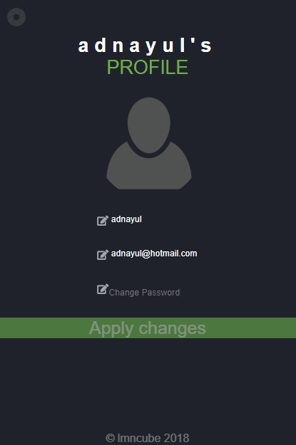

  

# wethinkcode_ Johannesburg

## Camagru

Web Project

- This project is simply creating an instagram-like clone using HTML, CSS & javasrcipt (Other Frameworks/Microframeworks/Libraries were forbidden).  

  
  

